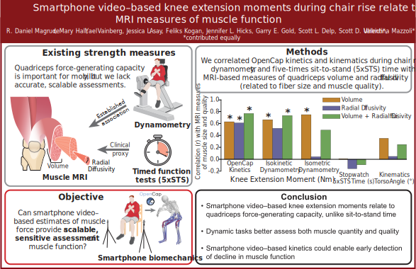

# MRI-OpenCap KEM Analysis

  

## Overview

Loss of muscle function contributes to mobility limitations, falls, and loss of independence with aging, yet objective assessments of muscle force-generating capacity remain difficult to deploy in routine clinical care. Magnetic resonance imaging (MRI) provides detailed measurements of muscle size and composition, while dynamometry directly measures strength; however, both approaches require specialized equipment and are not scalable for widespread monitoring.

This study evaluates whether **smartphone video–based biomechanical analysis** can provide a clinically accessible estimate of muscle function. Using OpenCap-derived biomechanics during a sit-to-stand (chair rise) task, we test whether the estimated **knee extension moment (KEM)** relates to MRI-derived measures of quadriceps force-generating capacity.

Our goal is to validate low-cost biomechanical assessment as a scalable proxy for muscle function.

---

## Key Findings

- Smartphone video–based estimates of knee extension moment during chair rise relate to MRI measures of quadriceps force-generating capacity, unlike sit-to-stand time.
- Dynamic tasks better reflect MRI-derived muscle quantity and quality.
- Smartphone video-based kinetics could enable rapid, early detection of changes in muscle status, prior to functional decline.

---

## Preprint

This work is available on bioRxiv:
Magruder et al., 2026. Smartphone video-based estimates of the knee extension moment during chair rise relate to MRI measures of muscle function. BioarXiv
